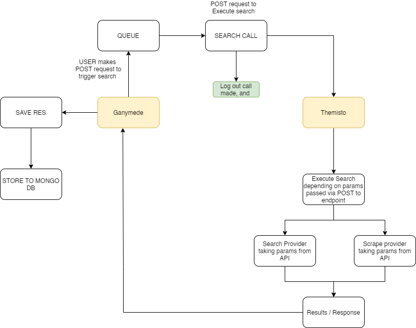
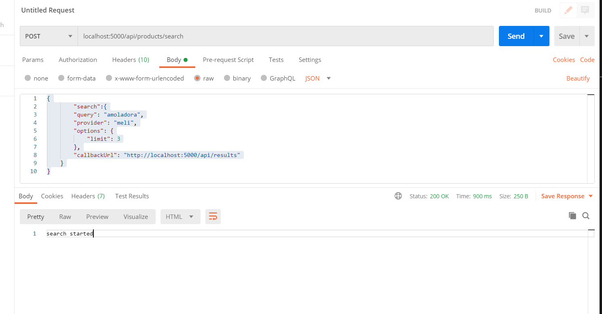

# Ganymede:
One app, called Ganymede, exposes the web service API, handles persistence, and
delegates search jobs. Persistence is done in a MongoDB database.

Express server API that makes requests to another express server API, called Themisto.
Ganymede scaffolds a search object, saves it in the DB, and then sends it to Themisto. Themisto makes the search, and sends the results back to Ganymede which updates the DB.

· Express Server
· MongoDB Database
· Rest API

Initial architecture sketch:



## Endpoints

### Search a product

**Method**: POST
**Endpoint**: /api/products/search
**Descritpion**: Uses Themisto to Search for products.
**Params/Headers**: Content-Type: Application/Json

#### How to use: 
You'll need a way to send post requests. 
Open Postman: 
if you are working on your localhost, to start a search do the following:
   
   1. Select POST request. 
   2. Add as an address localhost or herokuapp - /api/products/search 
   3. Add a Content-Type header of application/json
   4. Add a raw body as follows:
  

The format of your JSON should be like this

```javascript
{
        "search":{
            "query": "Amoladora", // What you want to search
            "provider": "meli", // Meli or Easy for now, these are the only 2 providers
            "options": {
                "limit": 3 // Meli has a limit options, since meli is HUGE, this number limits the amount of pages to search. 50 items per page
            },
            "callbackUrl": "http://localhost:5000/api/results" //Callback URL for now this one is the only one.
    }
}

```
  
**Query**: Your search query   
**Provider**: There is only two providers. Easy is done via scraping with puppeteer. Meli is done via Meli's internal API. 
**Options**: For now, added options to limit meli search.
**CallbackUrl**: For now there is only one results callback url, but in the future there could be more than one depending what one would want to do with the results.

If a parameter is missing, you'll get a warning error thanks to express-validator.
If using a non-ephimeral server, all requests would be saved to access.log thanks to morgan package.

### Get a previous search

**Method**: GET
**Endpoint**: /api/products/search-order/:id
**Descritpion**: Searches for a previous existing order by ID.

example: http://localhost:5000/api/products/search-order/5f3adcd86cd71f6acc36f4b1

### Get all previous searches

**Method**: GET
**Endpoint**: /api/products/search-orders/
**Descritpion**: Retrieves all the DB.

example: http://localhost:5000/api/products/search-orders/

### Get all previous searches with specific category

**Method**: GET
**Endpoint**: /api/products/search-orders/category/:cat
**Descritpion**: Retrieves all products within cat.

example: http://localhost:5000/api/products/search-orders/category/herramientas-electricas


## Version History:
0.1 - Initial scaffolding: Express Server, Mongoose connection to Atlas DB, router scaffolding.  
0.2 - Search route cleanup with status for orders.  
0.3 - Added Express-Validator, fixed bug with order status not being updated. Added morgan logger to fs.  
0.4 - Added endpoints for search. Improved Readme.md